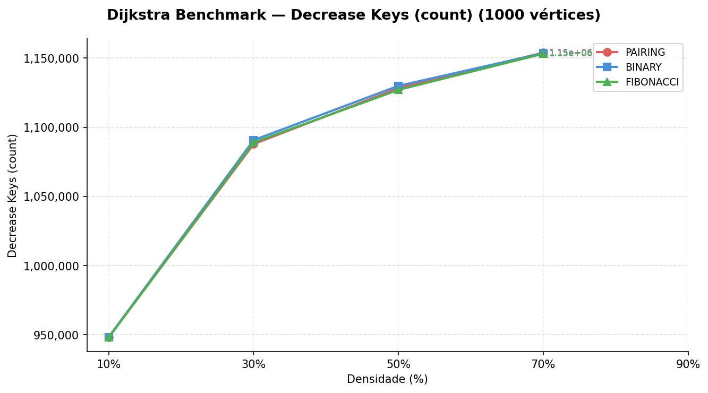
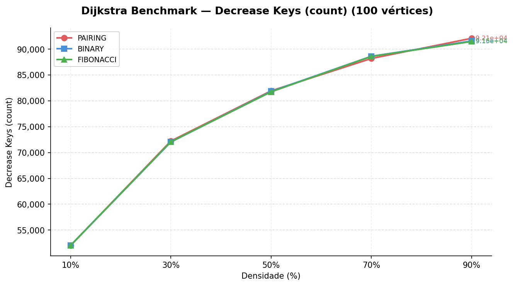
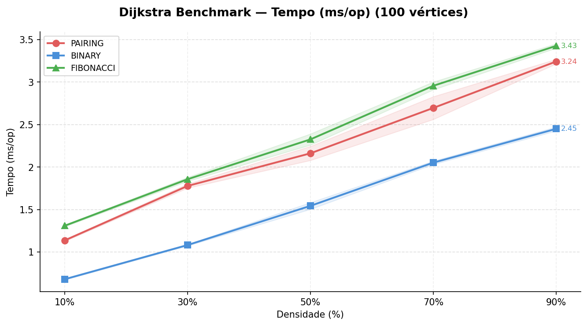
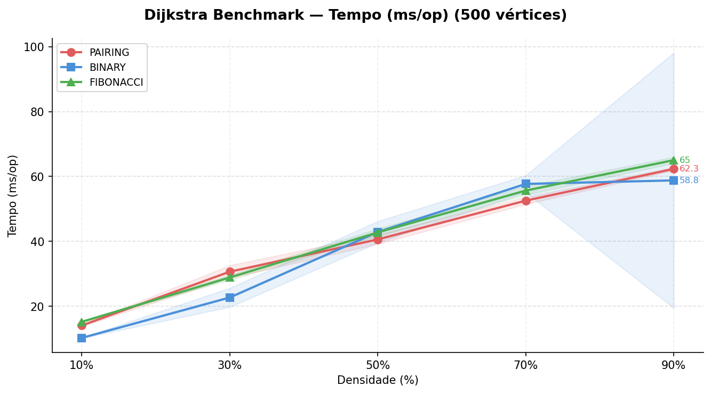
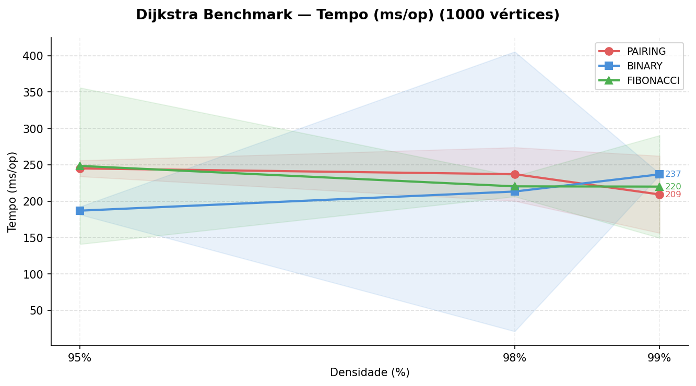
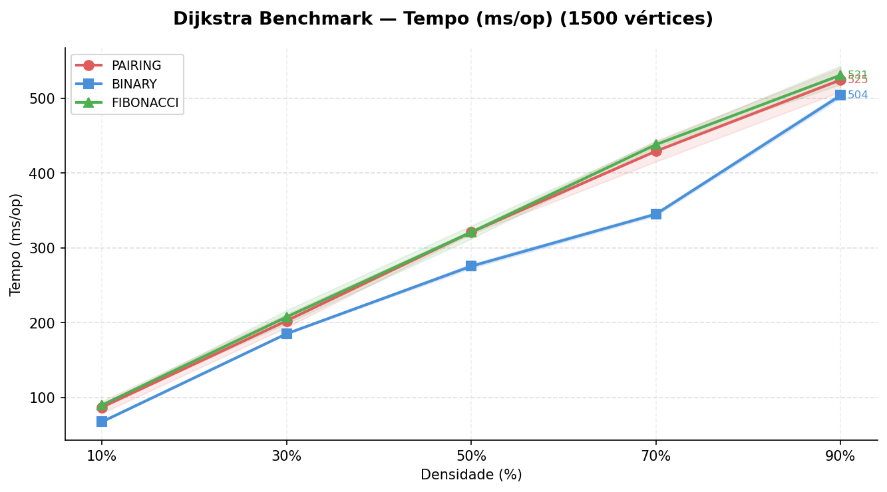
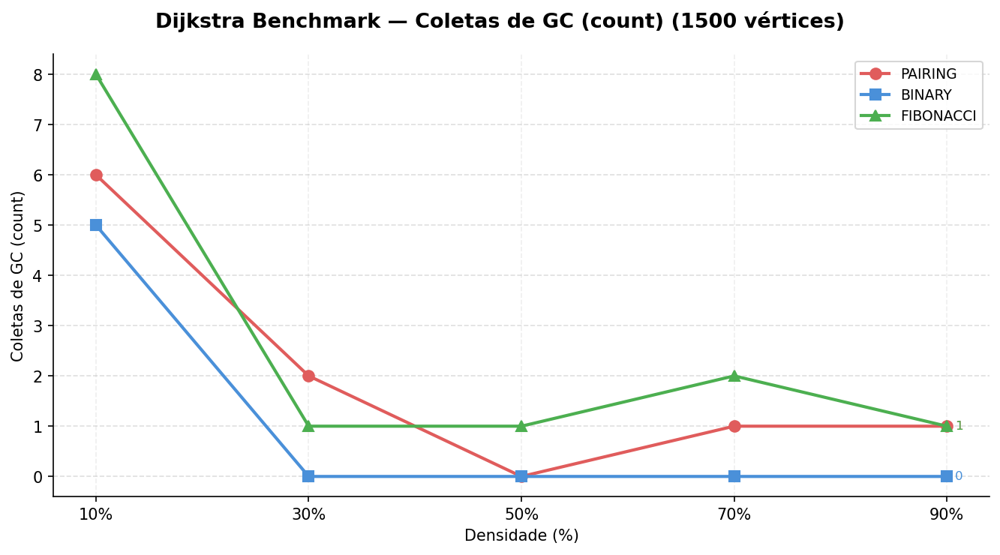

# Análise Experimental de Diferentes Estruturas de Heap no Desempenho do Algoritmo de Dijkstra

Projeto desenvolvido para a disciplina de **Estrutura de Dados e
Algoritmos** do curso de **Ciência da Computação da UFCG**.

## Introdução

O algoritmo de Dijkstra é um algoritmo de menor caminho para grafos com pesos
não negativos, sendo aplicado em sistemas de navegação, roteamento de redes e outros problemas de otimização. O desempenho desse algoritmo depende diretamente da estrutura de dados utilizada para implementar sua fila de prioridade. Diferentes implementações podem apresentar comportamentos distintos na prática, mesmo quando a análise teórica sugere vantagens assintóticas.
Neste projeto realizamos uma **análise experimental do algoritmo de Dijkstra utilizando diferentes estruturas de heap**, buscando comparar seu desempenho em grafos com diferentes tamanhos e densidades.
    
## Contextualização

Uma etapa fundamental do algoritmo de Dijkstra é a utilização de uma **fila de prioridade**, responsável por selecionar o vértice com menor distância estimada. Durante sua execução, duas operações são particularmente importantes:

- `extractMin`: remove o vértice com menor distância.
- `decreaseKey`: atualiza a distância estimada de um vértice.

A eficiência dessas operações depende diretamente da estrutura de dados utilizada para implementar a fila de prioridade. Neste projeto analisamos experimentalmente três estruturas de heap:

- **Binary Heap**
- **Pairing Heap**
- **Fibonacci Heap**

Cada uma apresenta diferentes complexidades assintóticas para essas operações:

| Estrutura        | Complexidade Extract-Min | Complexidade Decrease-Key | Complexidade Total Dijkstra |
|------------------|--------------------------|----------------------------|------------------------------|
| Binary Heap      | O(log V)                 | O(log V)                   | O((V + E) log V)             |
| Pairing Heap     | O(log V) amortizado      | O(log V) amortizado        | O((V + E) log V)             |
| Fibonacci Heap   | O(log V) amortizado      | O(1) amortizado            | O(V log V + E)               |

Consequentemente, a complexidade do algoritmo de Dijkstra varia de acordo com a estrutura utilizada:

- **Binary Heap / Pairing Heap:** `O((V + E) log V)`
- **Fibonacci Heap:** `O(V log V + E)`


## Objetivo

Estudar e analisar o comportamento das diferentes estruturas de dados na 
fila de prioridade do Dijkstra, e verificar se o seu comportamento assintótico 
segue na prática quando testado com diferentes tipos de grafos.

## Como rodar os experimentos

#### Requisitos
- Java
- Maven
- python3
- 20GB de RAM disponíveis

#### Execução
```bash
./run-benchmark.sh
```

## Metodologia

A pesquisa adotou uma abordagem experimental controlada, seguindo esses passos:

**Primeiro Passo: Implementação das estruturas e adaptações do algoritmo de Dijkstra**

Foram implementadas diferentes estruturas de prioridade, Binary Heap, Fibonacci Heap e Pairing Heap, utilizando da interface MyPriorityQueue para formar o contrato dos métodos “*Insert*”, “*decreaseKey*” e “*extractMin*”. As estruturas foram modificadas, para garantir que elas pudessem ser utilizadas corretamente na análise, utilizando as mesmas entradas.
Após a implementação dessas estruturas de dados, elas foram utilizadas no algoritmo de Dijkstra, adaptando-o para receber cada estrutura devidamente. Essa abordagem permite que a lógica do algoritmo permaneça inalterada e garante que as diferenças no experimento sejam apenas ligadas às diferenças estruturais e operacionais de cada variação. 

**Segundo Passo:  Geração de entradas**

Foram geradas as entradas, através de um script na linguagem de programação Python, para a criação de grafos usando diferentes perfis estruturais, como grafos esparsos e grafos densos.

Densidades: 10%, 30%, 50%, 70%, 90%, 95%, 98%, 99%

Tamanhos: 100, 500, 1.000, 1.500 vértices

Os pesos das arestas foram gerados aleatoriamente e os grafos são garantidamente conectados, para assegurar que haja caminhos possíveis para qualquer par de vértices. 


**Terceiro Passo: configuração do ambiente de testes e análise dos resultados**
	
Os testes foram realizados por meio de um Benchmark, utilizando a biblioteca JMH (Java Microbenchmark Harness), que mediu o tempo médio para a execução do algoritmo de Dijkstra, variando o tamanho, densidade e tipo de estrutura implementada. Os resultados foram processados e apresentados em gráficos comparativos, que foram gerados pela biblioteca matplotlib, do Python. Nos parâmetros utilizados neste experimento, foi utilizado 1 *fork* onde são realizadas 3 execuções de aquecimento seguidas de 5 ciclos de medição, com o tempo contado em milissegundos. As variáveis testadas foram o tipo de grafo (esparso, médio e denso), o tamanho (100, 500, 1.000 e 1.500 vértices) e o tipo de heap (Binary, Fibonacci e Pairing).


## Hipótese Teórica

Com base nas aproximações teóricas que foram expostas a respeito dos diferentes tipos de Heaps e nas características de hardware relevantes, formulamos as seguintes hipóteses:

1. Vantagem prática da Binary Heap: apesar da complexidade assintótica inferior ao demais Heaps, a Binary Heap apresentará menor tempo de execução na maioria dos cenários, devido a sua melhor localidade de cache.

2. Pairing Heap competitivo com Fibonacci: O Pairing Heap apresentará desempenho similar ou superior à Fibonacci Heap, pois na maioria dos casos, o seu *overhead* estrutural é menor, ou seja, Pairing Heap usa menos ponteiros, tornando-se mais eficiente.

3. Fibonacci Heap em grafos densos e grandes: A vantagem teórica da Fibonacci Heap se manifestará em grafos com alta densidade e grande número de vértices, onde o número de operações decreaseKey é elevado o suficiente para amortizar o *overhead* constante.

4. Impacto da densidade no número de operações decreaseKeys: É esperado que o número de chamadas da operação cresça conforme a densidade do grafo também aumenta, independente da estrutura de heap utilizada.

## Análise dos resultados

**Contagem de operações DecreaseKey:**

No cenário do algoritmo de Dijkstra para diferentes filas de prioridade, a contagem de operações de decreaseKeys torna-se importante para garantir que o experimento é justo, no caso, são usados os mesmos grafos para testar o algoritmo com os três tipos de Heap. Além disso, o fato da contagem ser a mesma para as três significa que o Dijkstra encontrou o mesmo caminho em todos os casos, ou seja, o que vai diferenciar os resultados é o custo interno do método, que é seguido pelo contrato formado na interface MyPriorityQueue.



Como apresentado no gráfico acima, as três estruturas apresentaram contagens praticamente idênticas para um mesmo grafo, confirmando a hipótese 4. Observa-se também que o número de chamadas ao decreaseKey cresce proporcionalmente à densidade do grafo, pois grafos mais densos possuem mais arestas e, consequentemente, mais oportunidades de encontrar caminhos melhores durante a execução do algoritmo.
Em casos pontuais, pode haver uma diferença mínima na contagem, em decorrência das diferentes formas como cada estrutura trata os vértices processados, mas isso não tem impacto significativo nos resultados.




**Tempo de Execução no Dijkstra com Diferentes Densidades.**
Essa seção apresenta os resultados quantitativos obtidos nos experimentos organizados por tamanho de grafo. Os gráficos exibem o tempo de execução em ms/op em função da densidade do grafo.

**Para Grafos Pequenos (100 vértices):**



Para grafos com 100 vértices, a Binary Heap demonstrou ser superior em todas as densidades testadas. Pode-se verificar que o tempo de execução do Binary Heap encontra-se na ordem de 0,03 ms/op, enquanto as outras estruturas fazem parte da ordem de 1,3 ms/op, um tempo 43 vezes maior que o Binary Heap.

**Para Grafos Médios(500 vértices a 1000 vértices):**



Na segunda rodada de testes com o grafo de 500 vértices, observa-se uma vantagem clara do Binary Heap em grafos mais esparsos(10% - 30%). Porém, na medida em que a densidade aumenta, podemos observar uma equiparidade dos resultados e até mesmo uma inversão de resultados para o Fibonacci e Pairing Heap, mostrando-se mais eficiente. Observa-se que o Pairing Heap é um pouco mais eficiente devido ao *overhead*.



Para uma nova rodada de teste com 1000 vértices, o comportamento em baixas densidades (10% - 50%) segue o padrão já observado: a Binary Heap mantém vantagem consistente. O resultado mais relevante surge quando analisamos densidades altas (70% - 90%), onde essa vantagem se inverte. Nesse cenário, o *overhead* dos ponteiros do Pairing Heap são superados pelas operações do Binary Heap, beneficiando-se do maior número de decrease-key realizados em grafos densos para amortizar as operações.

**Para grafos grandes (1500 vértices)** 



Para grafos com 1500 vértices, o Binary Heap se mostrou mais eficiente para densidades menores (entre 10% e 50%). A partir de 50% de densidade, em teoria, o Pairing Heap e o Fibonacci Heap deveriam ser mais eficientes que o Binary, porém, o *overhead* de alocação de Nodes nessas estruturas acaba acionando o garbage collector mais vezes.
No gráfico abaixo, a diferença de tempo é explicada, pois a execução do Binary Heap não tem mais acionamentos de GC para grafos com 30% de densidade ou mais, enquanto os outros dois continuam tendo acionamentos. 



## Ameaças à validade

1. Fatores de Hardware e Cache: Os experimentos realizados com 2000 vértices e extremamente densos apresentaram dados incompletos (timeout), limitando a comparabilidade nessas escalas.

2. Tipos de Grafos: Os experimentos foram realizados com um único tipo de grafo (aleatório com densidade uniforme). Grafos com estruturas específicas - como grafos de grade, scale-free ou grafos de redes - podem apresentar comportamentos distintos.

3. Execuções de vários cenários: A variabilidade entre execuções foi elevada em alguns cenários (como Pairing Heap em 500 vértices com diferentes densidades), sugerindo sensibilidade às condições de estado, principalmente, da JVM, de compilação JIT e do próprio Garbage Collection.

4. *Overhead* de implementação: Em teoria, para grafos grandes e densos, a operação decreaseKey do Fibonacci Heap ser O (1) amortizada deveria fazer essa estrutura ganhar leve vantagem, quando comparada com as outras duas. Entretanto, essa vantagem não se mostrou verdadeira em nossos testes, isso se deve, possivelmente, ao *overhead* prático dessa fila de prioridade, como alocações dinâmicas de Nodes,  *Cache Misses* e até acionamentos automáticos do Garbage Collector. Esse comportamento atesta que o comportamento assintótico esperado do Fibonacci Heap talvez só seja manifestado para grafos com volumes de vértices e arestas bem maiores do que os testados.

## Conclusão

Este experimento demonstrou empiricamente que a Binary Heap, estrutura com complexidade assintótica teoricamente inferior à Fibonacci Heap, supera as demais implementações na grande maioria dos cenários práticos testados. A diferença de desempenho pode chegar em até 40x para grafos pequenos, e é explicada perfeitamente pela melhor localidade de referência da Binary Heap em relação às estruturas baseadas em ponteiros. 
Sob outro ponto de vista, percebemos que a Fibonacci Heap apesar de sua vantagem teórica O(1) amortizado, não apresentou superioridade prática em nenhum cenário testado, confirmando a literatura que aponta o alto *overhead* dessa estrutura. Por outro lado, a Pairing Heap se posicionou como uma alternativa a Fibonacci Heap em questão de desenvolvimento, com a superação em diversos cenários, mas ainda assim inferior a Binary Heap. 
Logo, à luz dessas considerações, constata-se que esses resultados reforçam a importância da análise experimental com complemento indispensável à análise assintótica na engenharia de algoritmos. Isso porque, a escolha de uma estrutura de dados deve considerar não apenas a complexidade teórica, mas as características de hardware para cada objetivo almejado dentre os custos de implementação e manutenção. 

## Referências


